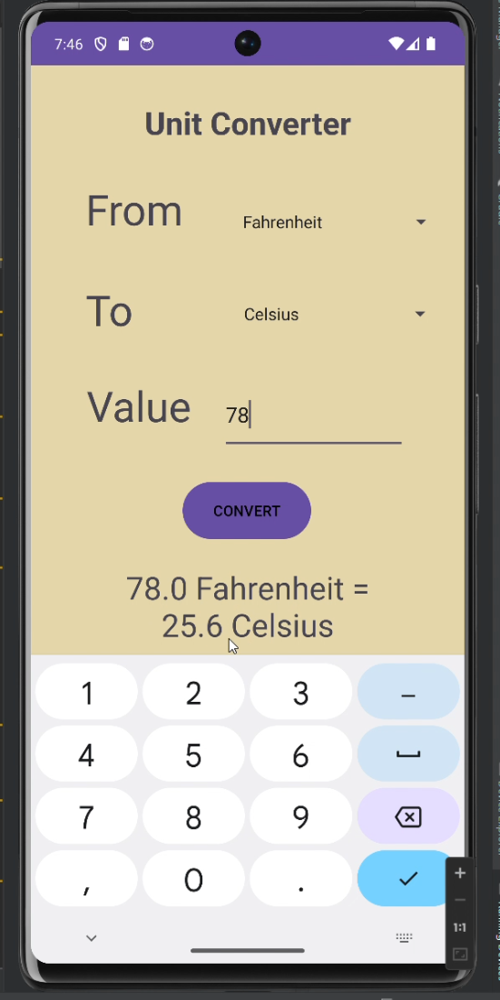

# Unit Converter App

This repository contains the **Unit Converter App**, a mobile application designed to provide quick and accurate unit conversions. The app is built using Java and Android Studio, featuring a clean user interface and supporting multiple unit categories.

## About the Project

The **Unit Converter App** was created to:
- Provide a convenient tool for converting between units of various measurements.
- Demonstrate core Android development concepts and practices.
- Enhance user productivity through an intuitive and efficient interface.

## Features
- **Unit Categories**:
  - Length (e.g., meters, kilometers, miles, feet).
  - Weight (e.g., kilograms, pounds, ounces).
  - Temperature (e.g., Celsius, Fahrenheit, Kelvin).
  - Time (e.g., seconds, minutes, hours, days).
- **Accurate Calculations**:
  - Ensures precise conversions for all supported units.
- **User-Friendly Interface**:
  - Simple and clean design for seamless navigation.
- **Real-Time Conversion**:
  - Converts input dynamically as values are entered.

## Screenshots




## Technologies Used
- **Java**
- **Android Studio**
- **XML** for layout design

## How to Run the App
1. Clone the repository:
   ```bash
   git clone https://github.com/Raf1dhasan/Unit_Converter-App.git
2. Open the project in Android Studio.
3. Sync the Gradle files to download dependencies.
4. Build and run the app on an emulator or a connected Android device.

## What I Did
-UI Design:
Designed the app's layout using XML to create a clean and intuitive user interface.
-Logic Implementation:
Wrote the conversion logic for various unit categories using Java.
-Real-Time Calculations:
Enabled dynamic conversions as users input values.
##  What I Did
-UI Design:
Designed the app's layout using XML to create a clean and intuitive user interface.
-Logic Implementation:
Wrote the conversion logic for various unit categories using Java.
-Real-Time Calculations:
Enabled dynamic conversions as users input values.
